## Dictionary

Words in toki pona often have vague definitions, their meaning depending on the context they appear in. They are also quite flexible as to where and how they appear within a sentence; for example _*kipisi*_ at first only had the definition of "to cut", but this meaning can be extrapolated to mean "cut" as an adjective, or "cutting" as a noun. In this dictionary, multiple meanings are listed for most words, however this *does not* mean that words without a definition as a noun cannot be use as one in the right context. *Function* (or *grammatical*) words are the only exceptions to this rule.

There are multiple different dictionaries that can be found with word counts most ranging between 118--150. *pu*, the "official Toki Pona book" written by jan Sonja, had a 120/123 word dictionary -- where 6 words were merged in pairs. *ku*, the "Toki Pona Dictionary" also by jan Sonja, had a main word count ("ku suli") of 137, with even more words present as it contained every word that were in use at the time, among others ("ku lili"); this can add up as high as 190.  
Due to the small number of words, definitions may be vague and toki pona relies more on context than most languages. It also prefers to "leave out" unimportant details, favoring simplicity.
{ .hidden }

This dictionary contains 141 words (135 common + 9 archaic ones), including the entirety of *pu*'s dictionary, in addition to select pre-pu words (that were either replaced or deprecated) and post-pu words -- these additions are all present in *ku*. Word usage can vary between individual groups, but generally it is best practice to mostly restrict ourselves to use words found in *pu*; non-pu words will have a `p`&shy;`u` part after their definitions to offer "pu friendly" alternatives and older, archaic words that are seldom used will be marked with a leading asterisk `* `.
{ .hidden .keep }

### Abbreviations

`n`
: noun

`v`
: verb (either transitive or intransitive)

`a`
: pre-verb or auxiliary verb

`p`
: preposition

`m`
: modifier (_adjective_ or _adverb_)

`f`
: function word (grammatical words)

`#`
: numerical value

`i`
: interjection

`c`
: conjunction

`l`
: meanings of the word if it stands alone before _la_

`pu`
: current versions or alternatives of _non-pu_ words

`see`
: see also (very similar words, or was at one point merged with marked words)

Numbers following any of these letters mark *alternative* definitions.

### A

__a__ 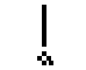  
`m`&shy;`1` (emotional) emphasis  
`m`&shy;`2` exaggeration, superlative (after _adjectives_)  
`i`&shy;` ` ah! I got it! Hahaha! (as "a a a")  
`see`&shy;` ` kin

__akesi__ 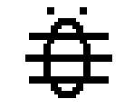  
`n`&shy;`1` reptile, amphibian  
`n`&shy;`2` non-cute animal, monster (dialectal)  
_non-cute animal_ definition has been removed in the Toki Pona Dictionary.

__ala__   
`n`&shy;` ` nothing, no one, null, the lack of (something)  
`v`&shy;` ` deny  
`m`&shy;` ` no, not  
`i`&shy;` ` no!

__alasa__   
`n`&shy;` ` hunting, searching  
`v`&shy;`1` hunt, forage, gather  
`v`&shy;`2` look for, search determinedly  

__ale/ali__ 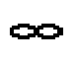  
`n`&shy;` ` everything, life, universe  
`m`&shy;` ` all, each, every, countless  
`#`&shy;` ` all, countless amount  
`#`&shy;`1` 100  
`l`&shy;`a` all told, nevertheless, despite everything, either way  
_ale_ was the original, while _ali_ was added to avoid ambiguity with _ala_ in speech.

__anpa__ 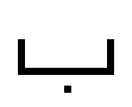  
`n`&shy;` ` bottom, below  
`v`&shy;`1` kneel, bow, accept (the terms)  
`v`&shy;`2` defeat, beat, conquer, enslave  
`m`&shy;`1` low, below, down, beneath  
`m`&shy;`2` dependent

__ante__   
`n`&shy;` ` change, difference, diversity  
`v`&shy;` ` alter, change, convert, transform  
`m`&shy;`1` different, altered, changed  
`m`&shy;`2` other  
`l`&shy;`a` or, otherwise

__anu__ 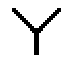  
`f`&shy;` ` or  
`l`&shy;`a`  or

__apeja__ 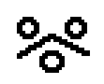  
`n`&shy;` ` depression, abuse, shame, dishonor  
`v`&shy;` ` verbal attack, disgrace, depress  
`m`&shy;` ` shameful, dishonored, depressive  
`p`&shy;` ` ike, utala toki  
Added in early 2010, but was not included in _pu_.

__awen__ 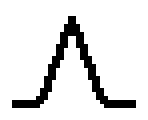  
`n`&shy;` ` waiting, staying  
`v`&shy;`1` wait, wait for (with "tawa"), stay, remain  
`v`&shy;`2` keep something unchanged
`a`&shy;` ` keep  
`m`&shy;` ` kept, protected (from change), remaining  
`l`&shy;`a` still

### E

__e__    
`f`&shy;`1` separates the predicate and the object  
`f`&shy;`2` and (if there are multiple objects)

__en__   
`f`&shy;` ` and (between subject)  
`l`&shy;`a` and, additionally

__esun__   
`n`&shy;` ` business  
`v`&shy;` ` buy, do business  
`m`&shy;` ` financial, for sale

### I

__ijo__   
`n`&shy;` ` something, thing, object  

__ike__ 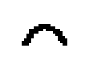  
`n`&shy;` ` bad(ness), evil  
`v`&shy;` ` ruin, spoil  
`m`&shy;` ` bad, negative, wrong, corrupted, evil, complex  
`l`&shy;`a ` sadly

__\*iki/ipi__  
`pu`&shy;` ` ona  
_ipi_ was replaced for its similarity to _ike_, while _ipi_ was replaced before first draft.
{ .hidden }

__ilo__   
`n`&shy;` ` tool, machine, device

__insa__   
`n`&shy;` ` inside  
`n`&shy;` ` stomach, organ  
`m`&shy;`1` internal  
`m`&shy;`2` inner, inside, center, among

### J

__jaki__ 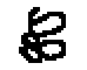  
`n`&shy;` ` dirt, garbage, filth, sh\*t  
`v`&shy;` ` stain, defile  
`m`&shy;` ` disgusting, toxic, unclean

__\*jalan__  
`pu`&shy;`` noka
Proposed replacement for _noka_ by jan Sonja. The community voted against it.
{ .hidden }

__jan__ 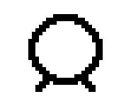  
`n`&shy;` ` human, person  
`m`&shy;` ` humanoid, human-like

__jelo__ 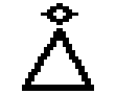  
`m`&shy;` ` yellow

__jo__   
`v`&shy;` ` have, own, carry, contain

### K

__kala__   
`n`&shy;` ` fish  
`m`&shy;` ` fish-like, aquatic

__kalama__   
`n`&shy;` ` sound, noise, roar  
`v`&shy;` ` produce a sound, yell, bawl  
`m`&shy;` ` loud, audible

__kama__ 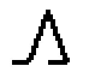  
`a`&shy;` ` become, will, pursue actions to arrive to (a certain state)  
`m`&shy;` ` _something_-to-be in the future, coming, arriving

__\*kan__  
`f`&shy;` ` among, with, near by  
`pu`&shy;` ` poka, kepeken  
Removed in 2003 in favor of _poka_ and _kepeken_.
{ .hidden }

__\*kapa__  
`pu`&shy;` ` nena  
It was the first word to be replaced, for unknown reasons.
{ .hidden }

__\*kapesi__  
`m`&shy;` ` brown, gray  
`pu`&shy;` ` pimeja  
Removed in 2002 without a replacement.
{ .hidden }

__kasi__   
`n`&shy;` ` plant, vegetation  
`m`&shy;` ` plant-like, green (after _kule_)

__ken__   
`n`&shy;` ` ability, chance, possibility  
`a`&shy;` ` can, able to, allowed to  
`m`&shy;` ` able, possible, allowed

__kepeken__ 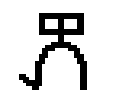  
`p`&shy;` ` use, with  
`v`&shy;` ` use

__kijetesantakalu__ 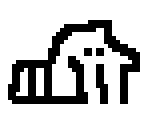  
`n`&shy;` `  animal from the Procyonidae family (such as raccoons and kinkajous)  
`pu`&shy;` ` soweli  
Added as an April Fool's joke in 2009, now it is a "fan favorite".

__kili__ 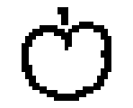  
`n`&shy;` ` fruit, vegetable, mushroom

__kin__   
`m`&shy;`1` also, too  
`m`&shy;`2` confirmation, emphasis (not as strong as _a_)  
`l`&shy;`a` also, and  
`see`&shy;` ` a

__kipisi__ 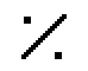  
`v`&shy;` ` cut  
`pu`&shy;` ` tu  
Presented along with _namako_ and _monsuta_ around 2010, not included in _pu_.

__kiwen__   
`n`&shy;` ` metal, rock, stone, hard object  
`m`&shy;` ` hard, heavy  
Originally _wawa ma_ was used before this word was created.

__ko__   
`n`&shy;` ` semi-solid material, paste, powder, clay, dough

__kon__ 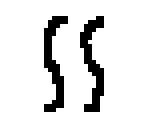  
`n`&shy;`1` air, breath  
`n`&shy;`2` spirit, essence, meaning, sense, concept  
`n`&shy;`3` mind, consciousness, soul  
`m`&shy;` ` air-like, gaseous

__ku__   
`n`&shy;` ` the _Toki Pona Dictionary_  
`v`&shy;` ` interacting with the _Toki Pona Dictionary_  
`m`&shy;` ` according to/as in/by the _Toki Pona Dictionary_  

__kule__ 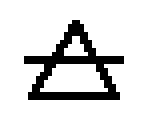  
`n`&shy;` ` color  
`v`&shy;` ` color  
`m`&shy;` ` colorful, pigmented

__kulupu__   
`n`&shy;`1` group, collection, set  
`n`&shy;`2` community, nation, society

__kute__ 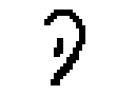  
`n`&shy;` ` ear  
`v`&shy;` ` hear, listen to

### L

__la__   
`p`&shy;` ` separates the context and the main sentence

__lanpan__   
`v`&shy;` ` take, seize, steal, catch, receive  
`pu`&shy;` ` kama jo, alasa  
It was coined by the community shortly after *pu* was released, making it one of the most used _nimi sin_.

__lape__   
`v`&shy;` ` sleep, rest

__laso__ 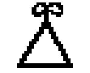  
`m`&shy;`1` blue  
`m`&shy;`2` green (_kule kasi_ is often preferred)

__lawa__ 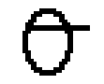  
`n`&shy;`1` head  
`n`&shy;`2` leader  
`v`&shy;` ` lead, rule, manage, control, direct  

__leko__ 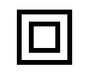  
`n`&shy;` ` stairs, square, block, edge  
`pu`&shy;` ` sike ala  
Removed from then-official dictionary in 2004.

__len__   
`n`&shy;`1` cloth, fabric, textile  
`n`&shy;`2` cover, layer  
`v`&shy;` ` wear, cover, hide  
`m`&shy;` ` clothed, covered, covering  

__lete__   
`m`&shy;`1` cold  
`m`&shy;`2` raw, uncooked

__li__ 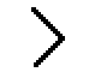  
`f`&shy;`1` separates the predicate and the object
`f`&shy;`2` and (between predicates)  

__lili__ 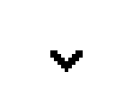  
`m`&shy;`1` small, little, short  
`m`&shy;`2` young  
`m`&shy;`3` a bit, slightly

__linja__   
`n`&shy;` ` hair, rope, thread
`m`&shy;` ` long and flexible, rope-like

__lipu__ 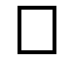  
`n`&shy;` ` document, book, website, written record  
`m`&shy;`1` flat, page-like  
`m`&shy;`2` documented

__loje__ 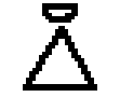  
`m`&shy;` ` red

__lon__   
`m`&shy;` ` existing, real, true  
`v`&shy;`e ` place (position if after _lon_), put (position if after _tawa_)  
`f`&shy;` ` located at, at the time of  
`f`&shy;` ` indeed, that's right  
`f`&shy;` ` general yes  
`l`&shy;`a ` really, trully  
`i`&shy;`nt ` indeed (as an _approval_, not as an answer to a question)

__luka__ 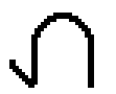  
`n`&shy;` ` hand, arm  
`m`&shy;` ` tangible, palpable  
`m`&shy;`od ` with hands, by hands  
`n`&shy;`um ` five

__lukin__ 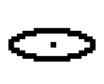  
`n`&shy;` ` eye  
`v`&shy;` ` look, see, examine, read, watch; (with _tawa_) search, look for, seek    
`a`&shy;` ` try to  
`m`&shy;` ` visible, readable  
`m`&shy;`od ` seemingly, looking (like "good looking")  
`see`&shy;` ` oko

__lupa__ 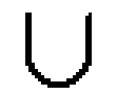  
`n`&shy;` ` hole, orifice, window, door  
`v`&shy;` ` pierce, stab, dig  
`m`&shy;` ` full of holes, holey

### M

__ma__ 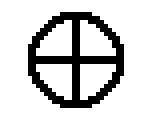  
`n`&shy;` ` earth, land, country, place, outdoor area  
`m`&shy;` ` outside

__\*majuna__ 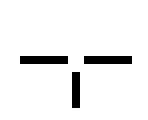  
`m`&shy;` ` old  
`pu`&shy;` ` sin ala, lili ala, suli  
Removed before first public draft.
{ .hidden }

__mama__ 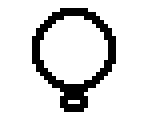  
`n`&shy;` ` parent, ancestor, origin, creator, caretaker  
`m`&shy;` ` parent, ancestor, parental

__mani__ 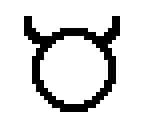  
`n`&shy;` ` money, wealth, livestock, value, currency  
`m`&shy;` ` valuable

__meli__   
`n`&shy;` ` female, woman, girl, wife, girlfriend  
`m`&shy;` ` female, feminine

__mi__ 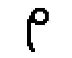  
`n`&shy;` ` I, me; we, us  
`m`&shy;` ` my, mine; our, ours

__mije__   
`n`&shy;` ` male, man, husband, boyfriend  
`m`&shy;` ` male, masculine

__moku__   
`n`&shy;` ` food, meal  
`v`&shy;` ` consume, eat, drink, inhale, swallow  
`m`&shy;` ` edible

__moli__   
`n`&shy;` ` death  
`v`&shy;` ` die, dying  
`v`&shy;`e ` murder, kill  
`m`&shy;` ` dying, sentenced to death, dead, lethal, mortal, fatal

__monsi__ 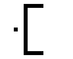  
`n`&shy;` ` back, behind, rear end  
`v`&shy;` ` retreat  
`m`&shy;`od ` back  
`d`&shy;`ir ` behind

__monsuta__   
`n`&shy;` ` monster, fear  
`v`&shy;` ` fear, be afraid of  
`m`&shy;` ` frighten, frightening  
`m`&shy;` ` fearful, afraid  
`pu`&shy;` ` ike, akesi  
Added in 2010 along with _kipisi_ and _namako_, not included in _pu_.

__mu__ 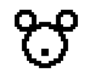  
`n`&shy;` ` animal noise, meaningless or incomprehensible talking   
`v`&shy;` ` make animal noise, speak incomprehensibly  
`m`&shy;` ` meaningless, incomprehensible, unintelligible

__mun__   
`n`&shy;` ` moon, star  
`m`&shy;` ` lunar

__musi__   
`n`&shy;` ` play, fun, game, art, artifact  
`v`&shy;` ` play, have fun  
`v`&shy;`e ` entertain  
`m`&shy;`od ` artistic, entertaining

__mute__ 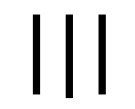  
`n`&shy;` ` amount, quantity  
`v`&shy;` ` multiply, spread, extend  
`a`&shy;`dv ` (comparative adjective)  
`m`&shy;`od ` many (3+), a lot, more, much, very  
`n`&shy;`um ` twenty

### N

__namako__   
`n`&shy;` ` additional, spice (for food)  
`v`&shy;` ` flavor, update  
`m`&shy;`od ` extra, additional  
`see`&shy;` ` sin  
Added along with _kipisi_ and _monsuta_ in 2010. In _pu_ it was merged with _sin_.

__nanpa__ 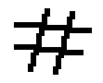  
`n`&shy;` ` number  
`v`&shy;` ` count, number, quantify  
`m`&shy;` ` countable, finite  
`p`&shy;` ` -th (ordinal number)

__nasa__ 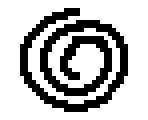  
`v`&shy;` ` fool around  
`m`&shy;` ` unusual, strange, weird, crazy, intoxicated

__nasin__   
`n`&shy;` ` way, method, custom, path, road  
`v`&shy;` ` follow, adopt  
`v`&shy;` ` indoctrinate; plan, plot; clear a path  
`m`&shy;`od ` methodical, systematic, doctrinal

__nena__ 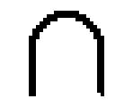  
`n`&shy;` ` bump, button, mountain, hill, nose  
`m`&shy;` ` bumpy, hilly, undulating

__ni__ 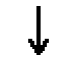  
`n`&shy;` ` this, that  
`m`&shy;` ` this, that  
`p`&shy;` ` that (as a conjunction, after _e_ or a _preposition_)

__nimi__   
`n`&shy;` ` name, word  
`v`&shy;` ` name (the name is after _sama_)

__noka__ 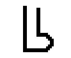  
`n`&shy;` ` foot, leg, organ of locomotion, lower part  
`v`&shy;` ` kick  
`m`&shy;` ` lower (on something)  
`a`&shy;`dv ` on foot, with foot

### O

__o__   
`p`&shy;` ` (marks imperative and vocative)  
`p`&shy;` `&shy;`sep ` separates the noun of direct address and the sentence

__oko__   
`n`&shy;` ` eye  
`v`&shy;` ` look (but not _see_)
`see`&shy;` ` lukin

__olin__ 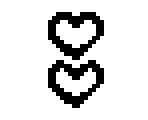  
`n`&shy;` ` love  
`v`&shy;` ` love, adore  
`m`&shy;` ` lovable, loving

__ona__ 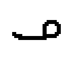  
`n`&shy;` ` they (singular and plural)  
`m`&shy;`od ` their, theirs (singular and plural)

__open__   
`n`&shy;` ` start, beginning  
`v`&shy;` ` begin, start, open, turn on (_not_ sexually)  
`a`&shy;` ` begin to, start to  
`m`&shy;` ` available, open, turned on (_not_ sexually), ready

### P

__pakala__   
`n`&shy;` ` error, bug, accident, mistake, damage  
`v`&shy;` ` brake, damage, mess up  
`m`&shy;` ` broken, damaged, harmed, messed up  
`i`&shy;`nt ` dammit! shoot!

__pake__   
`n`&shy;` ` blocking, prevention, obstruction  
`v`&shy;` ` block, obstruct, prevent  
`m`&shy;` ` blocked, prevented  
Suggested by jan Sonja, never officially added.

__pali__ 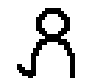  
`n`&shy;` ` working, job, process  
`v`&shy;` ` do, make, build, prepare, work (on)  

__palisa__   
`n`&shy;` ` rot, stick; long and solid (hard) thing  
`m`&shy;` ` long and solid (hard)

__pan__   
`n`&shy;` ` bread, cereal, corn, rice, grain

__pana__   
`n`&shy;` ` giving, sharing  
`v`&shy;` ` give, send, share, publish, release  
`m`&shy;` ` given, shared, public

__\*pasila/pasi__   
`see`&shy;` ` pona
_pasila_ was replaced before the first public draft; _pasi_ was a typo.
{ .hidden }

__pi__ 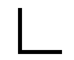  
`p`&shy;` ` of (marks the possessor)  
`p`&shy;` `&shy;`sep ` separates modifier groups after the noun

__pilin__ 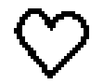  
`n`&shy;` ` feeling, instinct, emotion, heart (sometimes after _insa_)  
`v`&shy;` ` feel, smell, sense, guess, think about (an opinion)  
`m`&shy;`od ` feeling, emotionally

__pimeja__   
`n`&shy;` ` darkness  
`v`&shy;` ` darken  
`m`&shy;` ` dark, unlit, black, hidden (metaphorically)

__pini__   
`n`&shy;` ` end, finish, past  
`v`&shy;` ` finish, end, stop, complete, turn off  
`a`&shy;` ` end, finish, stop  
`m`&shy;`od ` finished, past, former, ex-

__pipi__ 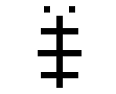  
`n`&shy;` ` insect, bug, spider

__poka__ 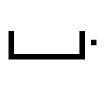  
`n`&shy;` ` side, hip  
`p`&shy;` ` along with, together with, next to  
`p`&shy;` ` with  
`d`&shy;`ir ` near, next to, side of

__poki__   
`n`&shy;` ` box, container, bag, bowl  
`v`&shy;` ` contain  

__pona__   
`n`&shy;` ` good, help, peace  
`v`&shy;` ` help (someone), repair, fix, improve  
`m`&shy;` ` good, positive, friendly, useful, simple, nice, right (_not_ the direction)  
`a`&shy;`dv ` well  
`i`&shy;`nt ` great! thanks!

__\*po__  
`n`&shy;`um ` four  
`pu`&shy;` ` tu tu  
Removed before toki pona became well-known.
{ .hidden }

__powe__ 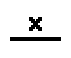  
`n`&shy;` ` being false, cheating, trick  
`v`&shy;` ` be false, deceive, pretend, cheat, trick  
`m`&shy;` ` false, untrue  
`pu`&shy;` ` lon ala, toki ike, ike  
Never was added to any official dictionary.

__pu__   
`n`&shy;` ` the _Toki Pona Book_  
`v`&shy;` ` interacting with the _Toki Pona Book_  
`m`&shy;` ` according to/as in/by the _Toki Pona Book_  

### S

__sama__   
`n`&shy;` ` equality, each other (usually after _e_)  
`v`&shy;` ` to make similar  
`m`&shy;` ` same, similar, sibling, fellow  
`p`&shy;` ` like, as, same as, equal to  
`l`&shy;`a ` similarly, like

__seli__   
`n`&shy;` ` heat, fire, chemical reaction  
`v`&shy;` ` cook, bake, heat  
`m`&shy;` ` hot, warm, cooked

__selo__   
`n`&shy;` ` outer layer, outer side, shell, skin, wall, separator  
`v`&shy;` ` separate  
`m`&shy;` ` outer (side)

__seme__   
`n`&shy;` ` what? who?  
`m`&shy;` ` which? what kind?  
`a`&shy;`dv ` how?  
`p`&shy;` ` what? which? wh-? (creates a question)

__sewi__   
`n`&shy;` ` area above, highest part, top    
`n`&shy;` ` god, sky  
`v`&shy;` ` get up, arise, lift, raise up, win  
`v`&shy;` ` worship, adore  
`m`&shy;` ` divine, sacred, holy, supernatural  
`m`&shy;` ` formal, religious, elevated, superior  
`d`&shy;`ir ` above, up

__sijelo__   
`n`&shy;` ` body, torso  

__sike__   
`n`&shy;` ` round or circular thing  
`v`&shy;` ` repeat, rotate  
`v`&shy;` ` form into a circle, encircle, surround  
`a`&shy;` ` repeat  
`m`&shy;` ` round, circular, spherical  
`a`&shy;`dv ` repeatedly, again and again  
`m`&shy;` ` of one year

__sin__   
`v`&shy;` ` renew, freshen, upgrade  
`m`&shy;` ` new, fresh, another  
`see`&shy;` ` namako

__sina__   
`n`&shy;` ` thou, you  
`m`&shy;` ` thy, thine, your, yours

__sinpin__   
`n`&shy;` ` face, front  
`n`&shy;` ` wall  
`m`&shy;` ` front, facial  
`d`&shy;`ir ` front of

__sitelen__   
`n`&shy;` ` drawing, writing, picture, image, symbol, visual representation  
`n`&shy;` ` letter  
`v`&shy;` ` draw, write, paint  
`m`&shy;` ` written, drawn  
`m`&shy;` ` representational, metaphorical, figurative

__sona__   
`n`&shy;` ` knowledge, science (of something), intelligence, wisdom  
`v`&shy;` ` know, skilled in  
`a`&shy;` ` know how to  
`m`&shy;` ` known, smart (figuratively, like in "smart phone")  

__soweli__   
`n`&shy;` ` animal, mammal, land animal  
`n`&shy;` ` lovable animal  
`m`&shy;` ` wild, animalistic

__su__   
`n`&shy;` ` _The Wonderful Wizard of Oz (Toki Pona edition)_  
`v`&shy;` ` interacting with the _The Wonderful Wizard of Oz (Toki Pona edition)_  
`m`&shy;` ` according to/as in/by the _The Wonderful Wizard of Oz (Toki Pona edition)_  

__suli__   
`m`&shy;` ` big, large, adult, heavy, important

__suno__   
`n`&shy;` ` sun, light, shine  
`n`&shy;` ` light source  
`m`&shy;` ` bright, lit, shining, gold (color)

__supa__   
`n`&shy;` ` horizontal surface  
`m`&shy;` ` thing you can rest on

__suwi__   
`n`&shy;` ` candy, sweets  
`v`&shy;` ` sweeten  
`m`&shy;` ` cute, sweet, adorable  
`m`&shy;` ` innocent

### T

__tan__   
`n`&shy;` ` reason, ground  
`v`&shy;` ` reason, cause  
`m`&shy;` ` grounded  
`p`&shy;` ` because (of), since, by, from

__taso__   
`m`&shy;` ` only  
`c`&shy;`onj ` but

__tawa__   
`v`&shy;` ` move (something)  
`m`&shy;` ` moving  
`p`&shy;` ` going to, for, to

__telo__   
`n`&shy;` ` liquid, fluid, beverage, water  
`v`&shy;` ` water, wash  
`v`&shy;` ` swim  
`m`&shy;` ` liquid, wet  

__tenpo__   
`n`&shy;` ` time, moment, period  
`l`&shy;`a ` sometimes

__toki__   
`n`&shy;` ` speak, language  
`v`&shy;` ` say, talk, tell, communicate, think (of something grounded)  
`m`&shy;` ` spoken

__tomo__   
`n`&shy;` ` house, room, indoor space, home  
`m`&shy;` ` urban

__tonsi__   
`n`&shy;` ` non-binary, genderqueer, gender-nonconforming, transgender.  
`pu`&shy;` ` jan kule  
This word was coined by the community shortly after *pu* was released. "jan kule" is a possible alternative, though it is most often used as an umbrella term for the whole LGBTQ+ community.

__tu__   
`v`&shy;` ` cut  
`n`&shy;`um ` two

__\*tuli__  
`n`&shy;`um ` three  
`pu`&shy;` ` tu wan  
Removed before toki pona became well-known.
{ .hidden }

### U

__unpa__   
`n`&shy;` ` sex, making love, intercourse  
`v`&shy;` ` have sex with, copulate with  
`v`&shy;` ` have marital relation with  
`m`&shy;` ` sexual  
`a`&shy;`dv ` sexually

__uta__   
`n`&shy;` ` mouth, lips  
`v`&shy;` ` kiss  
`m`&shy;`od ` oral

__utala__   
`n`&shy;` ` fight, battle, war  
`v`&shy;` ` battle, challenge  
`m`&shy;` ` fighting

### W

__walo__   
`m`&shy;` ` white, light, pale, innocent, virgin

__wan__   
`m`&shy;` ` unique  
`n`&shy;`um ` one

__waso__   
`n`&shy;` ` bird  
`m`&shy;` ` winged (animal), flying (creature)

__wawa__   
`n`&shy;` ` energy, power  
`v`&shy;` ` energize, empower  
`m`&shy;` ` strong, powerful, energetic, intense

__weka__   
`v`&shy;` ` get away from, ignore, throw away, remove  
`m`&shy;` ` away, ignored

__wile__   
`n`&shy;` ` will, urge, need, hope  
`v`&shy;` ` want  
`a`&shy;` ` want, should, have to, must, need  
`m`&shy;` ` wanted, desired, necessary  

### Y

__yupekosi__   
`v`&shy;` ` to behave like George Lucas and revise your old creative works and actually make them worse  
`pu`&shy;` ` wile ike
*"nobody knows how to pronounce the y"*\[sic\] -- jan Sonja  